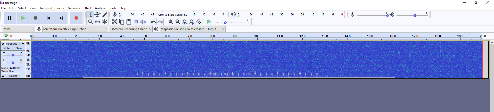
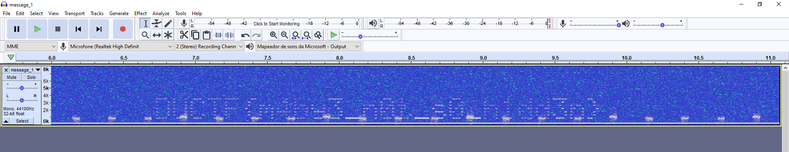

On the spectrum

- **Category:** Misc
- **Difficulty:** Beginner
- **Author:** scsc

My friend has been sending me lots of WAV files, I think he is trying to communicate with me, what is the message he sent?

**Attached file:** [message_1.wav](./message_1.wav)

## Writeup

The title of the challenge leads us to use a **Spectrometer** to analyze the sound file. We're going to open **Audacity** and use the spectrometer on the file.

It looks like there's something in there. Let's zoom in to have a better look.

There's the money shot! The flag is `DUCTF{m1by3_n0t_s0_h1dd3n}`.